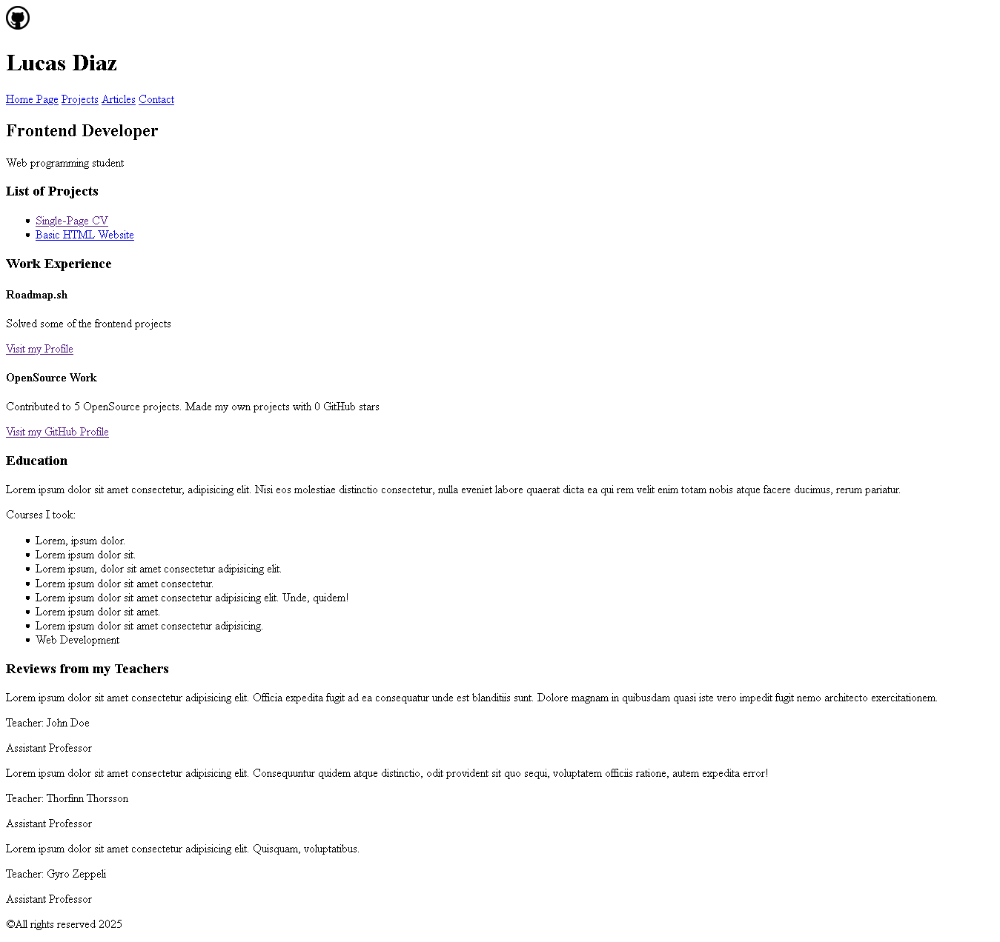

# Basic HTML Website

> Goal of this project is to teach you how to structure a website using HTML i.e. different sections of a website like header, footer, navigation, main content, sidebars etc. Do not style the website, only focus on the structure. Styling will be done in separate projects.

## Submission Checklist

- Learn how to create multiple pages in a website.
- Structure a website using HTML in a semantic way.
- Structure in a way that you can easily add styles later.
- Add SEO meta tags to the website.

## Credits  

- Github logo Icon by Zendesk Garden, licensed under [Apache 2.0](https://www.apache.org/licenses/LICENSE-2.0).  
  - Original source: [Github logo Icon](https://icon-icons.com/icon/github-logo/143772).
