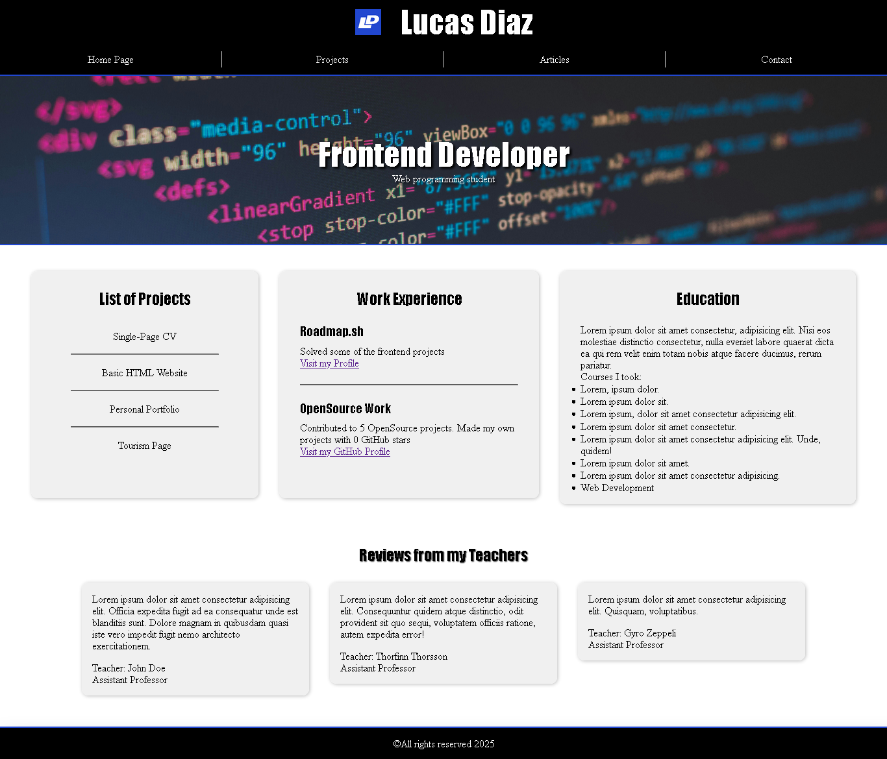
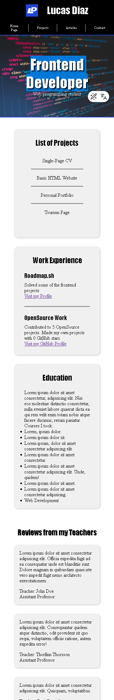

# Personal Portfolio

> The goal of this project is to teach you how to style a website using CSS. You will take the structure from the previous HTML-only project and apply various CSS techniques to enhance its appearance and responsiveness.

## Submission Checklist

- A fully styled, responsive website with the same structure as the previous project.
- Consistent use of a chosen color scheme and typography.
- Proper use of CSS techniques like Flexbox, media queries, and the box model.
- A responsive navigation bar and well-styled contact form.
