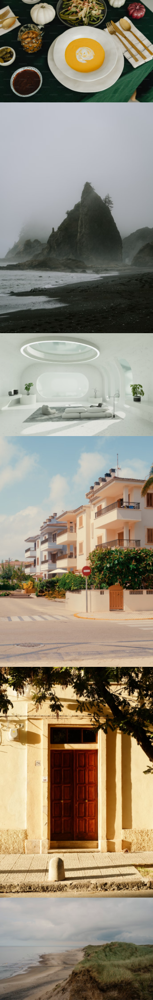

# Image Grid

> In this project, you are required to create a grid layout using HTML and CSS. You will be provided with six images that need to be arranged in a grid pattern based on the provided mockup. The primary focus of this project is to help you learn and practice the CSS Grid layout technique, which is essential for creating responsive and flexible web layouts.

